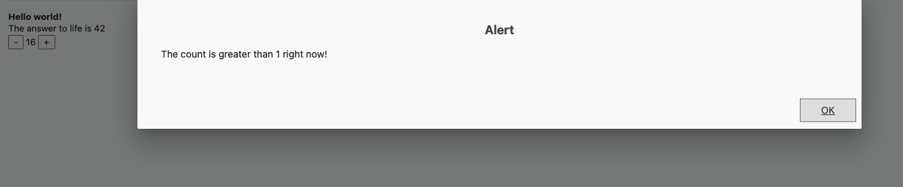
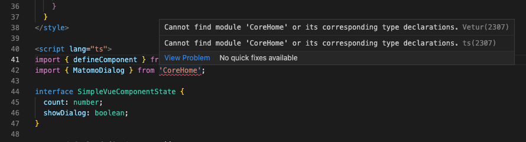

# Matomo SimpleVue Plugin

## Description

I created this SimpleVue project to demonstrate Vue Workflow in Matomo.

And to point out some bugs in the development process.

Hopefully, we can collaborate to get a better Developer Experience(DX).


### Steps done to create this plugin

Create Plugin:
```bash
$ ./console generate:plugin
Enter a plugin name: SimpleVue
Enter a plugin description: Demonstrate Workflow and fix issues.
Enter a plugin version number (default to 0.1.0):

Plugin SimpleVue 0.1.0 generated.
Our developer guides will help you developing this plugin, check out https://developer.matomo.org/guides
To see a list of available generators execute ./console list generate
Enjoy!
```

### Generate Vue Component
```bash
$ ./console generate:vue-component
Enter the name of your plugin: SimpleVue
Enter the name of the component you want to create: SimpleVueComponent

Vue component "SimpleVueComponent" for plugin "SimpleVue" in "/usr/local/var/www/matomo/plugins/SimpleVue/vue/src/SimpleVueComponent.vue" generated
You should now build the vue library using the vue:build command (use --watch to continuously build after making changes).
```

### Create a page to render our templates

But first!
```bash
$ ./console generate:controller
Enter the name of your plugin: SimpleVue

Controller for SimpleVue generated.
You can now start adding Controller actions
Enjoy!
```
### I haven't found a generator for templates, but this will do for now:
```bash
$ mkdir templates
$ cp plugins/ExamplePlugin/templates/index.twig plugins/SimpleVue/templates/index.twig
```

## Do some tweaking to get a nicer view

See all changes in [./docs/changes.diff](./docs/changes.diff)

## My issue

Compile Vue assets for production:
```bash
$ ./console vue:build SimpleVue
Building SimpleVue...
 ERROR  Build failed with errors.
Failed:
 ERROR  Failed to compile with 3 errors2:43:57 PM
 error  in /usr/local/var/www/matomo/plugins/SimpleVue/vue/src/index.ts
[tsl] ERROR in /usr/local/var/www/matomo/plugins/SimpleVue/vue/src/index.ts(9,10)
      TS2305: Module '"./SimpleVueComponent/SimpleVueComponent.vue"' has no exported member 'default'.
 error  in /usr/local/var/www/matomo/plugins/SimpleVue/vue/src/SimpleVueComponent/SimpleVueComponent.adapter.ts
[tsl] ERROR in /usr/local/var/www/matomo/plugins/SimpleVue/vue/src/SimpleVueComponent/SimpleVueComponent.adapter.ts(9,40)
      TS2307: Cannot find module 'CoreHome' or its corresponding type declarations.
 error  in /usr/local/var/www/matomo/plugins/SimpleVue/vue/src/SimpleVueComponent/SimpleVueComponent.vue.ts
[tsl] ERROR in /usr/local/var/www/matomo/plugins/SimpleVue/vue/src/SimpleVueComponent/SimpleVueComponent.vue.ts(3,22)
      TS7006: Parameter 'n' implicitly has an 'any' type.
 ERROR  Failed to compile with 3 errors2:43:58 PM
 error  in /usr/local/var/www/matomo/plugins/SimpleVue/vue/src/index.ts
[tsl] ERROR in /usr/local/var/www/matomo/plugins/SimpleVue/vue/src/index.ts(9,10)
      TS2305: Module '"./SimpleVueComponent/SimpleVueComponent.vue"' has no exported member 'default'.
 error  in /usr/local/var/www/matomo/plugins/SimpleVue/vue/src/SimpleVueComponent/SimpleVueComponent.adapter.ts
[tsl] ERROR in /usr/local/var/www/matomo/plugins/SimpleVue/vue/src/SimpleVueComponent/SimpleVueComponent.adapter.ts(9,40)
      TS2307: Cannot find module 'CoreHome' or its corresponding type declarations.
 error  in /usr/local/var/www/matomo/plugins/SimpleVue/vue/src/SimpleVueComponent/SimpleVueComponent.vue.ts
[tsl] ERROR in /usr/local/var/www/matomo/plugins/SimpleVue/vue/src/SimpleVueComponent/SimpleVueComponent.vue.ts(3,22)
      TS7006: Parameter 'n' implicitly has an 'any' type.
 ERROR  Failed to compile with 3 errors2:43:58 PM
 error  in /usr/local/var/www/matomo/plugins/SimpleVue/vue/src/index.ts
[tsl] ERROR in /usr/local/var/www/matomo/plugins/SimpleVue/vue/src/index.ts(9,10)
      TS2305: Module '"./SimpleVueComponent/SimpleVueComponent.vue"' has no exported member 'default'.
 error  in /usr/local/var/www/matomo/plugins/SimpleVue/vue/src/SimpleVueComponent/SimpleVueComponent.adapter.ts
[tsl] ERROR in /usr/local/var/www/matomo/plugins/SimpleVue/vue/src/SimpleVueComponent/SimpleVueComponent.adapter.ts(9,40)
      TS2307: Cannot find module 'CoreHome' or its corresponding type declarations.
 error  in /usr/local/var/www/matomo/plugins/SimpleVue/vue/src/SimpleVueComponent/SimpleVueComponent.vue.ts
[tsl] ERROR in /usr/local/var/www/matomo/plugins/SimpleVue/vue/src/SimpleVueComponent/SimpleVueComponent.vue.ts(3,22)
      TS7006: Parameter 'n' implicitly has an 'any' type.
```

## How to fix?

### Check our environment:
```bash
$ nvm version
v16.0.0
```

### What is the RECOMMENDED_NODE_VERSION? 
```bash
$ cat ./plugins/CoreVue/Commands/Build.php | grep 'RECOMMENDED_NODE_VERSION.*=' | grep -o "'.*'" | sed "s/'//g" | sed "s/^/v/g"
v16.0.0
```

### Build with watch:
```bash
./console vue:build SimpleVue --watch

⠧  Building for development as library (commonjs,umd,umd-min)... DONE  Compiled successfully in 4939ms2:49:16 PM

 DONE  Compiled successfully in 4984ms2:49:17 PM

 DONE  Compiled successfully in 5019ms2:49:17 PM

  File                                      Size             Gzipped

  plugins/SimpleVue/vue/dist/SimpleVue.d    50.06 KiB        7.86 KiB
  evelopment.umd.min.js
  plugins/SimpleVue/vue/dist/SimpleVue.d    50.06 KiB        7.86 KiB
  evelopment.umd.js
  plugins/SimpleVue/vue/dist/SimpleVue.d    49.47 KiB        7.68 KiB
  evelopment.common.js

  Images and other types of assets omitted.

No issues found.
No issues found.
No issues found.
```

## Success



## Annoying nagger



